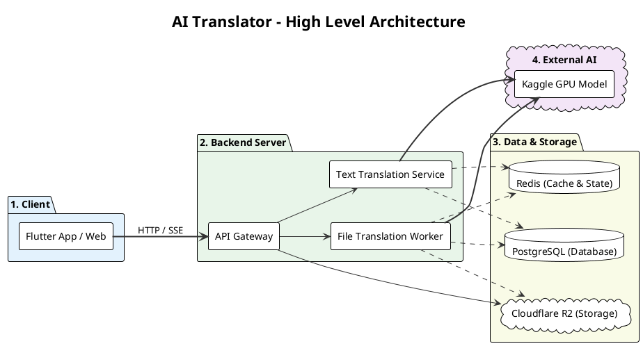

# Cấu Trúc Kiến Trúc Hệ Thống (PlantUML)
Bạn có thể copy toàn bộ đoạn mã PlantUML dưới đây và dán vào [PlantText](https://www.planttext.com/), [PlantUML Web](https://www.plantuml.com/plantuml/uml/) hoặc plugin tích hợp trong Draw.io (Arrange > Insert > Advanced > PlantUML) để sinh ra sơ đồ kiến trúc hoàn chỉnh.



### Hướng dẫn sử dụng trong Draw.io:
1. Truy cập [app.diagrams.net](https://app.diagrams.net/)
2. Tạo một bản vẽ trống.
3. Nhấp vào nút dấu cộng **`+`** trên thanh công cụ (hoặc menu **Arrange** > **Insert** > **Advanced** > **PlantUML...**).
4. Dán toàn bộ khối code nằm trong ```` ```plantuml .... ``` ```` ở trên vào ô.
5. Bấm **Insert**, draw.io sẽ tự động vẽ ra toàn bộ các khối kiến trúc và mũi tên cực kỳ chuyên nghiệp!
