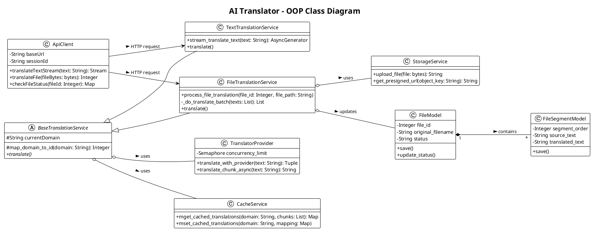

# Biểu Đồ Lớp (Class Diagram) - PlantUML
Bạn có thể copy toàn bộ đoạn mã dưới đây dán vào Draw.io (chọn **Arrange** > **Insert** > **Advanced** > **PlantUML...**) để sinh ra sơ đồ các lớp (Class Diagram) cho hệ thống.

Sơ đồ này tập trung vào 3 nhóm chính: **Database Models**, **Backend Services** và **Frontend Services**, bao gồm cả các thuộc tính và phương thức cốt lõi.

