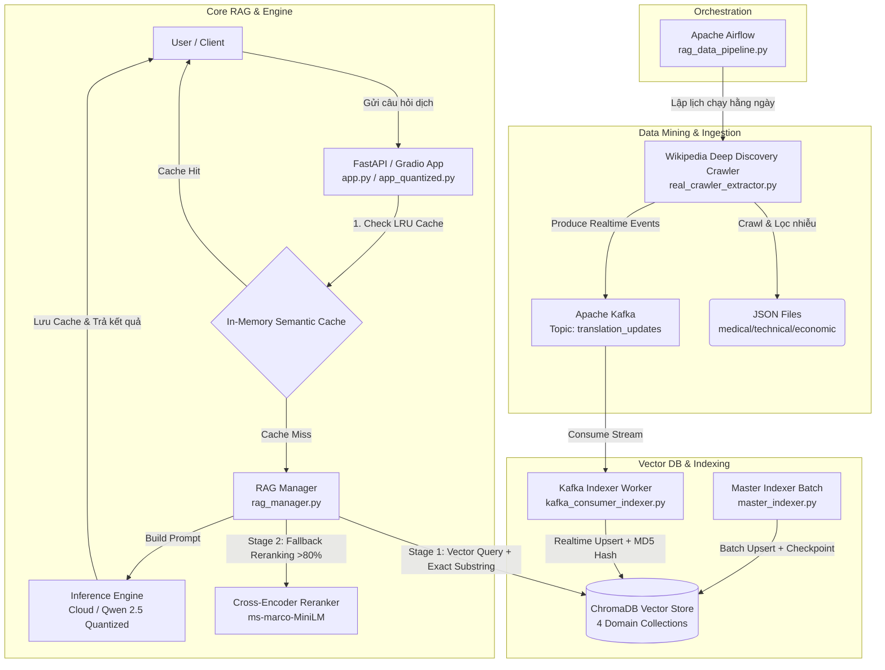

# 🌐 AI Translation RAG System (Enterprise-Grade)

<div align="center">
  
  
  
  
  
  
  
</div>

---

## 📖 Giới thiệu tổng quan (Executive Summary)

**AI Translation RAG System** là hệ thống dịch thuật chuyên ngành (Anh - Việt) tự động, độ chính xác cao, được thiết kế theo kiến trúc **Event-Driven RAG (Retrieval-Augmented Generation)**. Hệ thống giải quyết triệt để vấn đề dịch sai thuật ngữ chuyên ngành trong các lĩnh vực đặc thù như **Y tế (Medical)**, **Kinh tế (Economic)**, và **Công nghệ (Technical)** bằng cách kết hợp luồng thu thập tri thức tự động từ Wikipedia, xử lý luồng sự kiện qua Apache Kafka, lưu trữ vector với ChromaDB và tối ưu hóa suy luận LLM (hỗ trợ cả Cloud LLM và Local Quantized Models như Qwen 2.5).

---

## 🏗️ Kiến trúc hệ thống (System Architecture & Data Flow)

Hệ thống được chia thành 4 mảng kiến trúc chính hoạt động liên tục và đồng bộ với nhau:



### 🔍 Các thành phần cốt lõi:

#### 1. Data Mining & Ingestion (Thu thập và nạp dữ liệu)
- **Deep Discovery Crawler (`real_crawler_extractor.py`)**: Thuật toán cào dữ liệu Wikipedia V7 với cơ chế hàng đợi khám phá động (*Discovery Queue*). Bắt đầu từ các danh mục gốc (ví dụ: `Thể loại:Kinh tế học`), crawler tự động phát hiện các danh mục con mới để mở rộng phạm vi quét. Dữ liệu được lọc bỏ các từ chứa số/ký tự nhiễu, chuẩn hóa thành các cặp Anh-Việt và lưu trữ vào các file JSON nội bộ.
- **Event Streaming (`Kafka`)**: Mỗi thuật ngữ mới cào được sẽ lập tức được đẩy vào Kafka topic `translation_updates` để đảm bảo hệ thống có thể cập nhật tri thức theo thời gian thực mà không cần chờ batch lớn.

#### 2. Vector Database & Master Indexing (Lưu trữ và Lập chỉ mục)
- **ChromaDB Vector Store**: Lưu trữ dữ liệu phân mảnh theo 4 collections chuyên biệt: `medical_kb`, `economic_kb`, `technical_kb`, và `general_kb`. Sử dụng `DefaultEmbeddingFunction` (All-MiniLM-L6-v2) tối ưu cho việc nhúng ngữ nghĩa.
- **Băm MD5 & Lọc trùng lặp**: Mỗi thuật ngữ được băm MD5 (`glos_{domain}_{term_id}`) làm ID duy nhất, loại bỏ hoàn toàn nguy cơ trùng lặp dữ liệu khi upsert.
- **Master Indexer (`master_indexer.py`)**: Hỗ trợ nạp các bộ từ điển doanh nghiệp khổng lồ theo lô (batch 2000). Tích hợp cơ chế tự động lưu mốc kiểm tra (*Checkpointing* `index_checkpoint.json`), cho phép khôi phục tiến trình nạp dữ liệu chính xác tại vị trí bị ngắt quãng nếu xảy ra sự cố.
- **Kafka Indexer Service (`kafka_consumer_indexer.py`)**: Service chạy ngầm lắng nghe Kafka topic `translation_updates`, tự động nạp tri thức mới vào ChromaDB ngay khi crawler phát hiện.

#### 3. RAG Manager & Dual-Stage Retrieval (Quản lý RAG & Truy xuất 2 giai đoạn)
Được triển khai trong `core/rag_manager.py` với luồng truy xuất nghiêm ngặt nhằm triệt tiêu hiện tượng ảo giác (hallucination):
1. **In-Memory LRU Semantic Cache**: Các câu hỏi dịch thuật được lưu trong bộ nhớ đệm RAM với thuật toán LRU (Least Recently Used). Nếu câu hỏi trùng khớp, hệ thống trả về ngay lập tức với độ trễ gần như bằng 0.
2. **Stage 1 (Exact Substring Match)**: Truy vấn ChromaDB lấy top 20 ứng viên. Sau đó, hệ thống thực hiện quét chuỗi (*substring match*) để tìm chính xác thuật ngữ tiếng Anh xuất hiện trong câu cần dịch. Nếu khớp, sử dụng ngay nghĩa tiếng Việt tương ứng.
3. **Stage 2 (Cross-Encoder Reranker)**: Nếu không có từ nào khớp chính xác tuyệt đối, hệ thống kích hoạt mô hình `ms-marco-MiniLM-L-6-v2` để chấm điểm tương đồng ngữ nghĩa giữa câu input và các từ khóa ứng viên. Chỉ những từ đạt điểm tin cậy tuyệt đối (`score == 1.0` / >80%) mới được đưa vào prompt LLM.

#### 4. Inference Engines (Động cơ suy luận AI)
Hỗ trợ đa dạng các phương thức suy luận thông qua các class trong `core/engine.py` và `app_quantized.py`:
- **Cloud & Hybrid Inference**: Hỗ trợ gọi API Gemini 2.0 Flash hoặc các model HuggingFace/MLX linh hoạt với cơ chế Fallback (chuyển sang Dummy mode khi rớt mạng để bảo vệ pipeline).
- **Quantized Local Engine (`app_quantized.py`)**: Được thiết kế riêng cho các mô hình lớn như **Qwen 2.5 7B Fine-tuned**:
  - Tích hợp `BitsAndBytesConfig` nén 4-bit NF4 (Double Quantization), giảm VRAM yêu cầu từ **15GB xuống chỉ còn 4.5GB**, cho phép chạy mượt mà trên các GPU phổ thông (RTX 3060/4060, L4, T4).
  - Sử dụng `Flash Attention 2` tăng tốc độ xử lý attention matrix.
  - **Smart Chunking Algorithm**: Xử lý mượt mà các văn bản siêu dài (5000+ từ) bằng cách tự động chia nhỏ thành các đoạn 400 từ dựa trên dấu câu tự nhiên, dịch song song/nối tiếp và gộp kết quả hoàn chỉnh.
  - **Post-Processing Clean**: Tự động dọn dẹp các ký tự rác của LLM (như `<|im_end|>`, các câu giải thích thừa) và ép số dòng đầu ra khớp chuẩn với đầu vào.

---

## 📂 Cấu trúc thư mục (Directory Structure)

```text
RAG/
├── app.py                           # FastAPI Service chính (dùng Cloud/Hybrid Engine & Kafka Worker)
├── app_quantized.py                 # Standalone App (FastAPI + Gradio UI) chạy Local Quantized Qwen 2.5
├── master_indexer.py                # Script nạp dữ liệu từ điển lớn vào ChromaDB (hỗ trợ Checkpoint)
├── Dockerfile                       # Dockerfile đóng gói dịch vụ (dựa trên Apache Airflow image)
├── docker-compose.yaml              # Cấu hình orchestration toàn bộ hệ thống (Kafka, Airflow, API, Indexer)
├── requirements.txt                 # Danh sách thư viện phụ thuộc
├── core/
│   ├── engine.py                    # Khởi tạo các AI Engine (CloudInference, Gemini, Hybrid)
│   ├── kafka_worker.py              # Background Thread Worker xử lý Kafka message cho app.py
│   └── rag_manager.py               # Core logic quản lý RAG, LRU Cache, Vector Search & Reranker
├── crawlers/
│   ├── kafka_consumer_indexer.py    # Standalone Kafka Consumer nạp dữ liệu realtime vào VectorDB
│   ├── real_crawler_extractor.py    # Wikipedia Deep Discovery Crawler V7
│   ├── discovery_queue.json         # Trạng thái hàng đợi các danh mục Wikipedia đang khám phá
│   ├── discovery_done.json          # Danh sách các danh mục Wikipedia đã quét xong
│   ├── medical_terms.json           # Kho từ vựng Y tế thu thập được
│   ├── economic_terms.json          # Kho từ vựng Kinh tế thu thập được
│   └── technical_terms.json         # Kho từ vựng Công nghệ thu thập được
├── dags/
│   └── rag_data_pipeline.py         # Airflow DAG lập lịch chạy crawler tự động hằng ngày
└── VectorDB/                        # Thư mục chứa dữ liệu Vector (ChromaDB SQLite & Parquet files)
```

---

## 🚀 Hướng dẫn triển khai (Deployment Guide)

### 📋 Yêu cầu hệ thống (Prerequisites)
- **OS**: Linux / macOS (Apple Silicon M1/M2/M3) / Windows (WSL2).
- **Docker & Docker Compose**: Phiên bản mới nhất.
- **Python**: 3.10 trở lên (nếu chạy local không qua Docker).
- **Hardware (cho Local Model)**: GPU NVIDIA có ít nhất 6GB VRAM (nếu chạy Qwen 2.5 4-bit) hoặc Apple Silicon Mac (16GB RAM).

---

### Phương án 1: Triển khai toàn bộ hệ thống qua Docker Compose (Production)

Hệ thống sẽ tự động khởi chạy cụm dịch vụ bao gồm: Zookeeper, Kafka, PostgreSQL, Airflow Webserver/Scheduler, Kafka Indexer và Translator API.

```bash
# 1. Cấp quyền truy cập cho thư mục lưu trữ DB và DAGs (tránh lỗi permission trong Docker)
chmod -R 777 ./VectorDB ./dags ./crawlers

# 2. Khởi chạy toàn bộ hệ thống ở chế độ background
docker-compose up -d --build

# 3. Kiểm tra trạng thái các containers
docker-compose ps

# 4. Xem log của dịch vụ API dịch thuật
docker-compose logs -f translator-api
```

- **Airflow Web UI**: Truy cập `http://localhost:8080` (Tài khoản/Mật khẩu: `admin` / `admin`).
- **FastAPI Translator API**: Truy cập `http://localhost:8000/docs`.

---

### Phương án 2: Chạy độc lập dịch vụ Quantized Qwen 2.5 kèm Gradio UI

Dành cho nhu cầu triển khai mô hình LLM tối ưu hóa chạy trực tiếp trên máy chủ GPU hoặc máy cá nhân.

```bash
# 1. Cài đặt các thư viện cần thiết
pip install -r requirements.txt

# 2. Thiết lập biến môi trường (Trỏ tới thư mục chứa model đã tải hoặc tên model trên HuggingFace)
export MERGED_MODEL_PATH="Qwen/Qwen2.5-7B-Instruct" # Hoặc đường dẫn local
export VECTOR_DB_PATH="./VectorDB"
export PORT=8001

# 3. Khởi chạy ứng dụng
python app_quantized.py
```

- **Gradio Web UI (Giao diện người dùng trực quan)**: Truy cập `http://localhost:7860`.
- **FastAPI Docs**: Truy cập `http://localhost:8001/docs`.

---

## 🔌 Tài liệu API (API Documentation)

### 1. Kiểm tra trạng thái hệ thống (Health Check)
- **URL**: `/`
- **Method**: `GET`
- **Response**:
```json
{
  "status": "online",
  "model_path": "./model",
  "db_path": "./VectorDB"
}
```

### 2. Dịch thuật văn bản (Translate Endpoint)
- **URL**: `/translate`
- **Method**: `POST`
- **Headers**: `Content-Type: application/json`
- **Body**:
```json
{
  "text": "Inflation is a general increase in prices and fall in the purchasing value of money.",
  "domain": "Economic",
  "source_lang": "English",
  "target_lang": "Vietnamese"
}
```
- **Response**:
```json
{
  "translation": "Lạm phát là sự tăng giá chung và sự giảm giá trị mua hàng của tiền tệ.",
  "detected_domain": "Economic"
}
```

#### 💻 Ví dụ gọi API bằng cURL:
```bash
curl -X 'POST' \
  'http://localhost:8000/translate' \
  -H 'accept: application/json' \
  -H 'Content-Type: application/json' \
  -d '{
  "text": "Deep learning models require significant computational resources for training.",
  "domain": "Technical",
  "source_lang": "English",
  "target_lang": "Vietnamese"
}'
```

---

## ⏰ Cơ chế tự động hóa & Lịch trình (Airflow DAGs)

Hệ thống tích hợp sẵn DAG `rag_translation_pipeline` trong thư mục `dags/`.
- **Lịch trình (Schedule)**: `@daily` (Chạy tự động mỗi ngày một lần).
- **Quy trình hoạt động**:
  1. DAG kích hoạt chạy script `real_crawler_extractor.py`.
  2. Crawler cào các trang Wikipedia thuộc các danh mục trong `discovery_queue.json`.
  3. Lọc các thuật ngữ mới chưa từng xuất hiện và đẩy sự kiện lên Kafka topic `translation_updates`.
  4. Service `kafka-indexer` nhận message và nạp thẳng vào ChromaDB, giúp AI dịch thuật ngày càng thông minh và cập nhật từ vựng mới hoàn toàn tự động.

---

## 🛡️ Giấy phép & Bảo mật (License & Security)

- Hệ thống áp dụng các quy tắc bảo mật (*Anti-Injection*) ngay trong System Prompt của RAG Manager, ngăn chặn các cuộc tấn công Prompt Injection từ phía người dùng.
- Mã nguồn được phân phối dưới giấy phép **MIT License**. Bạn có thể tự do sử dụng, sửa đổi và phân phối trong các dự án thương mại hoặc cá nhân.
