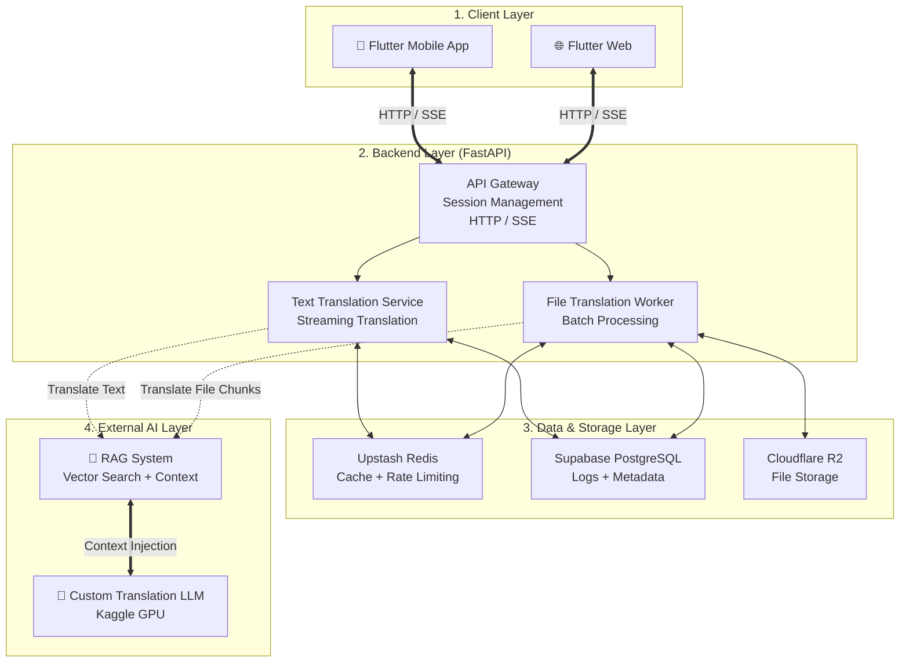

# AI Translator System 

Dự án Hệ thống Dịch thuật AI (AI Translator) đa nền tảng, hỗ trợ dịch thuật theo thời gian thực (Realtime Text Translation) và dịch tài liệu giữ nguyên định dạng (Document Translation). Dự án được thiết kế theo tiêu chuẩn Production với khả năng xử lý bất đồng bộ, chịu tải cao và quản lý tài nguyên linh hoạt.

---

## 👥 Đội ngũ Phát triển

| Mã Sinh Viên | Họ và Tên | Vai Trò (Nhiệm vụ) |
| :--- | :--- | :--- |
| **23001534** | Nguyễn Tiến Lưỡng | Leader, Admin |
| **23001562** | Phạm Thị Minh Thư | BA, Tester |
| **23001520** | Nguyễn Quốc Hiệu | Data Science |
| **23001963** | Lê Thị Yến | AI Engineer |
| **23001559** | Nguyễn Bảo Thạch | AI |
| **23001543** | Nguyễn Tuyết Như | Fullstack Production |

---

##  Tính năng Nổi bật (Core Features)

1. **Dịch Văn Bản Thời Gian Thực (Streaming SSE):** Trải nghiệm dịch thuật mượt mà trả về từng chữ như ChatGPT, hỗ trợ Debounce và tự động khôi phục (Auto-Resume) khi gián đoạn mạng. Hỗ trợ Nhập liệu bằng Giọng nói (STT) và Đọc kết quả (TTS).
2. **Dịch Tài Liệu Nguyên Bản (Document Translation):** Xử lý các tệp lớn (PDF, DOCX, TXT) dưới dạng Background Task. Giữ nguyên 100% định dạng, layout chữ, in đậm/nghiêng sau khi dịch.
3. **Đa nền tảng (Cross-platform):** Hoạt động trơn tru trên cả nền tảng Web và thiết bị di động (Android/iOS) chỉ với một source code Flutter.
4. **Quản lý Cache & Tối ưu Mạng:** Tích hợp Redis MGET Caching để lưu lại các đoạn đã dịch, giảm thiểu tối đa chi phí gọi AI và tăng tốc độ xử lý lên đến 80% với những tài liệu có độ trùng lặp cao.
5. **Bảo vệ Hệ thống (Fault Tolerance):** Cơ chế Semaphore giới hạn GPU, tự động ngắt (Timeout) và nhả tài nguyên khi client mất kết nối để tránh sập (OOM) Server AI.

---

##  Công nghệ Sử dụng (Tech Stack)

### **Frontend**
- **Framework:** Flutter (Web & Mobile)
- **Networking:** `http` package, Server-Sent Events (SSE), Multipart File Upload.
- **State Management:** Stateful UI, Lifecycle Observer (Xử lý chạy nền).

### **Backend**
- **Framework:** Python / FastAPI
- **Database:** PostgreSQL (Supabase) + SQLAlchemy (Async ORM)
- **Cache & PubSub:** Upstash Redis
- **Storage:** Cloudflare R2 (S3-compatible)

### **AI & Deployment**
- **AI Model:** Custom LLM Endpoint (Kaggle GPU + Ngrok)
- **Deployment:** Railway.app, Docker

---

## Thiết kế Hệ thống Tổng thể (System Architecture)

Sơ đồ dưới đây mô tả kiến trúc tổng thể của hệ thống AutoTrans, bao gồm luồng xử lý dữ liệu từ Client, Backend bất đồng bộ, tầng lưu trữ đám mây đến mô hình AI dịch thuật tích hợp RAG (Retrieval-Augmented Generation).



---

## 📂 Kiến trúc Dự án (Repository Structure)

```text
ai_trans_demo/
├── app_client/                 # Mã nguồn Frontend (Flutter)
│   ├── lib/
│   │   ├── features/           # Các màn hình chính (Dịch Text, Dịch File)
│   │   ├── services/           # Kết nối API, Local Cache
│   │   └── widgets/            # Các UI Component dùng chung
│   └── pubspec.yaml
│
├── backend/                    # Mã nguồn Backend (FastAPI)
│   ├── app/
│   │   ├── api/v1/             # Định nghĩa các Endpoints (REST & SSE)
│   │   ├── db/                 # Models & Cấu hình Database
│   │   ├── services/           # Xử lý Logic (Dịch, Background Tasks, Redis)
│   │   └── main.py             # Entry point
│   ├── alembic/                # Quản lý Database Migrations
│   ├── Dockerfile
│   └── requirements.txt
│
├── ARCHITECTURE_DIAGRAM.md     # Sơ đồ Kiến trúc Hệ thống (PlantUML)
└── CLASS_DIAGRAM.md            # Sơ đồ Lớp Hệ thống (PlantUML)
```

---

## ⚙️ Hướng dẫn Cài đặt Môi trường (Local Setup)

### 1. Backend (FastAPI)
1. Di chuyển vào thư mục backend: `cd backend`
2. Kích hoạt môi trường ảo (Virtual Environment): `python -m venv .venv` và `.venv\Scripts\activate` (Windows)
3. Cài đặt thư viện: `pip install -r requirements.txt`
4. Cấu hình file `.env` theo tệp `.env.example`.
5. Chạy server: `uvicorn app.main:app --reload --port 8000`

### 2. Frontend (Flutter)
1. Di chuyển vào thư mục frontend: `cd app_client`
2. Cài đặt các gói phụ thuộc: `flutter pub get`
3. Cấu hình file `lib/services/api_service.dart` (Bật/tắt cờ `useLocalBackend`).
4. Chạy ứng dụng:
   - Môi trường Web: `flutter run -d chrome`
   - Môi trường Mobile: `flutter run`

---

*Tài liệu được cập nhật mới nhất cho Phiên bản Production.*
